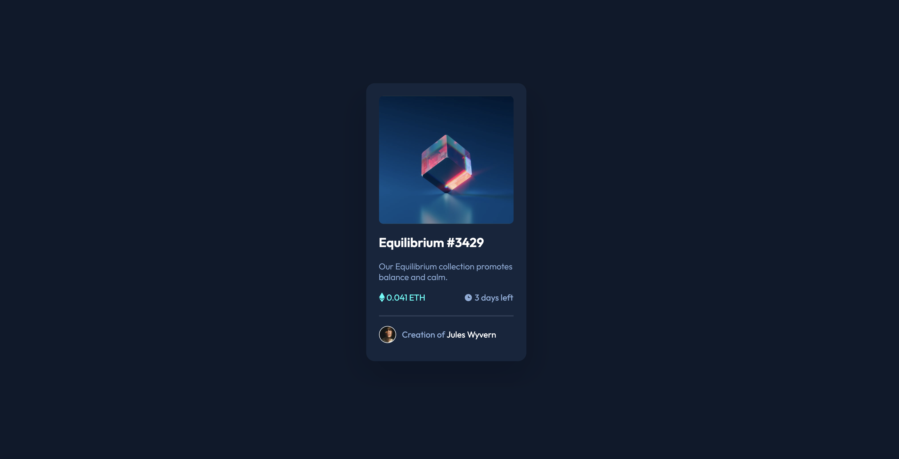

# Frontend Mentor - NFT preview card component solution

This is a solution to the [NFT preview card component challenge on Frontend Mentor](https://www.frontendmentor.io/challenges/nft-preview-card-component-SbdUL_w0U). Frontend Mentor challenges help you improve your coding skills by building realistic projects. 

## Table of contents

- [Overview](#overview)
  - [The challenge](#the-challenge)
  - [Screenshot](#screenshot)
  - [Links](#links)
- [My process](#my-process)
  - [Built with](#built-with)
  - [What I learned](#what-i-learned)
  - [Continued development](#continued-development)
- [Author](#author)

**Note: Delete this note and update the table of contents based on what sections you keep.**

## Overview

### The challenge

Users should be able to:

- View the optimal layout depending on their device's screen size
- See hover states for interactive elements

### Screenshot

### Links

- [Solution URL](https://github.com/karan101099/Frontent-Mentor-NFTCard)
- [Live Site URL](https://karan101099.github.io/Frontent-Mentor-NFTCard/)

## My process

### Built with

- HTML5
- CSS3

### What I learned

Learned positioning, aligning, and overlapping elements.

### Continued development

Implement FlexBox and Sass in the future.

## Author

- Website - [Prabakaran A S](https://github.com/karan101099)
- Frontend Mentor - [@karan101099](https://www.frontendmentor.io/profile/karan101099)
- Twitter - [@karan__asp](https://www.twitter.com/karan__asp)
